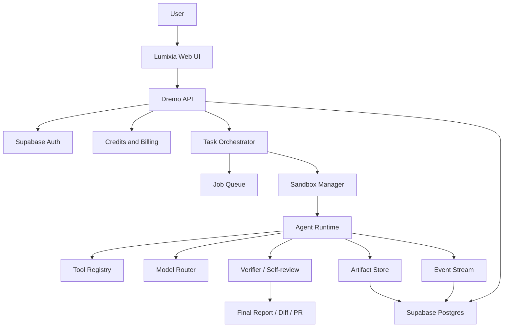

# Proposed Dremo Code Architecture

Status: proposed.

Dremo Code will be Lumixia's server-owned autonomous coding agent system. It should sit beside the existing dashboard and billing systems until it is mature enough to replace Code Architect AI.

## High-level Shape



## Component Responsibilities

| Component | Responsibility | Trust Level |
| --- | --- | --- |
| Lumixia Web UI | Render tasks, events, terminal output, diffs, approvals, reports, and artifacts. | Untrusted for writes to audit/runtime facts. |
| Supabase Auth | Validate user identity and session JWTs. | Trusted identity provider. |
| Supabase Database | Store tasks, events, approvals, artifacts, credit records, and compatibility data. | Trusted source of truth. |
| Dremo API Backend | Enforce auth, ownership, permissions, billing state, task lifecycle, and event writes. | Trusted application boundary. |
| Task Orchestrator | Own task state machine, retries, cancellation, repair loops, and finalization. | Trusted runtime controller. |
| Event Stream | Deliver ordered server-owned task events to the UI. | Trusted append-only audit surface. |
| Sandbox Manager | Create, limit, monitor, and destroy isolated task workspaces. | Trusted isolation layer. |
| Agent Runtime | Plan, inspect files, call tools, execute commands, and produce patches. | Semi-trusted; must be sandboxed. |
| Model Router | Select models and enforce token/cost/provider policies. | Trusted policy boundary. |
| Tool Registry | Controls which tools the agent can call and under which approval rules. | Trusted policy boundary. |
| Permission Engine | Decides which commands, files, network destinations, and write actions are allowed. | Trusted security boundary. |
| Verification Engine | Runs tests, static checks, self-review, and repair loops. | Trusted verifier with sandboxed execution. |
| Artifact Store | Stores reports, patches, logs, screenshots, and downloadable outputs. | Trusted storage boundary. |

## Request Flow

```text
User
  -> Lumixia Web UI
  -> Dremo API
  -> Task Orchestrator
  -> Sandbox Manager
  -> Agent Runtime
  -> Tools / Model Router
  -> Verifier / Self-review
  -> Final Report / Artifact / PR
```

## Proposed Task State Machine

| State | Meaning | Writable By |
| --- | --- | --- |
| `created` | Task exists but has not started execution. | Dremo API |
| `queued` | Task is accepted and waiting for orchestration. | Dremo API / orchestrator |
| `planning` | Repo/task inspection and plan generation are active. | Orchestrator |
| `awaiting_approval` | User approval is required before continuing. | Orchestrator |
| `running` | Agent is executing approved work. | Orchestrator |
| `verifying` | Tests, checks, and self-review are running. | Orchestrator |
| `repairing` | A safe repair loop is running after failed verification. | Orchestrator |
| `completed` | Task finished and report/artifacts are ready. | Orchestrator |
| `failed` | Task failed and no further automated repair is running. | Orchestrator |
| `cancelled` | User or policy cancelled the task. | Dremo API / orchestrator |

## Boundary With Current Lumixia Architecture

| Current Concept | Proposed Dremo Equivalent | Migration Direction |
| --- | --- | --- |
| Code Architect AI | Dremo Code | Keep name until backend is production-ready. |
| `execution-api` | Dremo API | Extend or replace with `/dremo/*` endpoints. |
| `execution_sessions` | `dremo_tasks` | Keep legacy tables during migration or expose compatibility views. |
| `execution_logs` | `dremo_task_events` | Move from text logs to structured ordered events. |
| Dashboard agent cards | Agent entry points | Card can launch Dremo task flow when ready. |
| Credits wallet | Dremo task billing states | Backend owns reserve, charge, release, and refund. |

## Operational Principles

| Principle | Requirement |
| --- | --- |
| Fail closed | If secure backend, billing, or sandbox config is missing, Dremo runs in safe stub/demo mode only. |
| Server-owned facts | Runtime events, task status, credit changes, and artifact metadata are written by trusted backend only. |
| One task, one sandbox | Every billable task gets isolated workspace state and cleanup rules. |
| No production secrets in sandbox | Sandboxes receive scoped, temporary credentials only when required. |
| Audit-first | Every privileged action must produce an immutable event. |
| Approval-aware | Dangerous commands, network access, large writes, and external publication require explicit approval policy. |
