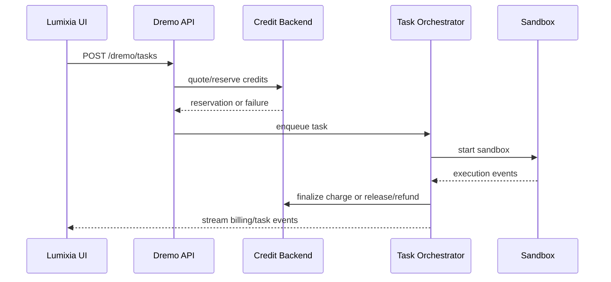

# Proposed Dremo Credit and Billing Flow

Status: proposed.

Dremo Code must use a trusted billing model. The browser must never decide final credit debit, refund, or release behavior. The backend must own all credit state transitions and write to the canonical Lumixia credit ledger.

## Current Context

Lumixia already has a prepaid credits architecture, Supabase Edge Functions, Stripe Checkout-first billing, hardened credit SQL functions, and an `execution-api` that can run in stub mode. Dremo should keep stub mode until the real backend, event stream, and sandbox runner are ready.

## Core Rules

| Rule | Requirement |
| --- | --- |
| Browser cannot charge | The frontend can request a task, but cannot decide debit/refund. |
| Backend reserves | Credits are reserved when billable execution starts. |
| Backend finalizes | Credits are charged when the task reaches billable completion. |
| Backend releases/refunds | Credits are released or refunded when the task fails/cancels before billable execution. |
| Audit required | Every credit state change must map to task, event, idempotency key, and ledger entry. |
| Fail closed | If credits cannot be checked safely, Dremo must not start billable execution. |

## Task Billing States

| State | Meaning | Writer |
| --- | --- | --- |
| `not_required` | Free/demo task or internal non-billable task. | Backend |
| `quoted` | Backend calculated expected credit requirement. | Backend |
| `reserved` | Credits are held for the task. | Backend |
| `running` | Billable work is executing. | Backend |
| `completed_charged` | Task completed and debit is finalized. | Backend |
| `failed_refunded` | Task failed and reserved/charged credits were refunded. | Backend |
| `cancelled_released` | User cancelled before billable completion and reservation was released. | Backend |
| `disputed` | Credit outcome is under support/admin review. | Backend/admin |
| `manual_review` | Automated billing finalization could not safely decide. | Backend/admin |

## Proposed Flow

## Ledger Mapping

| Dremo billing event | Credit ledger direction |
| --- | --- |
| Quote only | No ledger entry required unless quote audit table is added. |
| Reserve | Proposed reserved entry or reservation table; do not reduce available balance unless wallet design supports holds. |
| Final charge | `usage_debit` or Dremo-specific mapped debit in canonical ledger. |
| Release before charge | Mark reservation released; no final debit. |
| Refund after debit | `usage_refund` compensating entry. |
| Manual adjustment | Admin-only adjustment with mandatory reason. |

## Idempotency

| Operation | Idempotency key shape |
| --- | --- |
| Task create | `dremo:create:<user_id>:<client_key>` |
| Credit reserve | `dremo:reserve:<task_id>` |
| Final charge | `dremo:charge:<task_id>:<completion_sequence>` |
| Release | `dremo:release:<task_id>:<cancel_or_fail_sequence>` |
| Refund | `dremo:refund:<task_id>:<reason_sequence>` |

## Failure Handling

| Failure | Required behavior |
| --- | --- |
| Credit quote unavailable | Do not create billable task; show actionable error. |
| Reserve fails | Do not start sandbox execution. |
| Sandbox fails before billable work | Release reservation. |
| Sandbox fails after billable work | Apply policy: refund, partial charge, or manual review. |
| Charge finalization fails | Mark `manual_review`, restrict duplicate retries via idempotency. |
| Event write fails | Pause finalization if audit cannot be written. |

## Frontend Display

| Billing state | UI copy direction |
| --- | --- |
| `quoted` | "Estimated credits required." |
| `reserved` | "Credits reserved for this task." |
| `running` | "Billable execution is running." |
| `completed_charged` | "Credits charged after successful completion." |
| `failed_refunded` | "Credits returned because the task failed." |
| `cancelled_released` | "Reserved credits released." |
| `manual_review` | "Billing is under review; no duplicate charge will be attempted." |

## Stub Mode

The existing execution API can remain in stub mode while Dremo is being built. Stub mode must be clearly labeled as non-production execution and must not imply that real sandbox work, real Dremo billing, or real autonomous coding is active.
